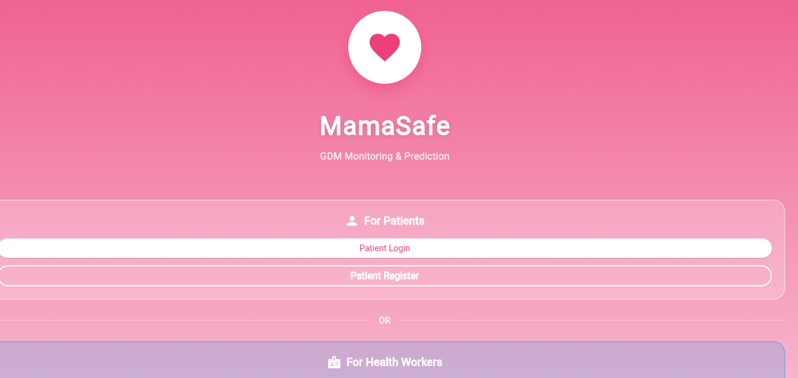
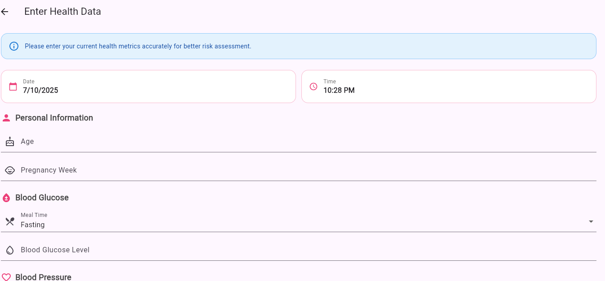
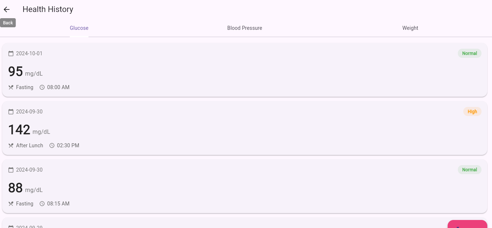

# 🤰 MamaSafe: Gestational Diabetes Mellitus (GDM) Prediction System

## 🧩 Description

**MamaSafe** is a hybrid system built with **FastAPI (Python)** for the backend and **Flutter** for the frontend.
It helps predict the **risk level of Gestational Diabetes Mellitus (GDM)** in pregnant women based on medical and lifestyle parameters such as glucose level, BMI, blood pressure, and age.

The goal is to enable **early diagnosis**, improve **maternal health monitoring**, and provide **Community Health Workers (CHWs)** and patients with a simple yet powerful prediction tool.

---

## 🔗 GitHub Repository

[👉 View MamaSafe on GitHub]([https://github.com/YourUsername/MamaSafe](https://github.com/MKangabire/Capstone/new/main?filename=README.md))
*(Replace this link with your actual repository URL)*

---

## 🗂️ Project Structure

```
MamaSafe/
│
├── backend/                   # FastAPI backend (Python)
│   ├── main.py                # API entry point
│   ├── models/                # Saved ML models (.pkl)
│   ├── data/                  # Datasets for training
│   ├── utils/                 # Helper functions
│   ├── requirements.txt       # Python dependencies
│   └── ...
│
├── mama_safe/                 # Flutter frontend
│   ├── lib/
│   │   ├── main.dart          # App entry file
│   │   ├── screens/           # UI screens (login, dashboard, etc.)
│   │   ├── models/            # Data models for API interaction
│   │   ├── services/          # API service calls (connects to FastAPI)
│   │   └── providers/         # State management
│   ├── assets/                # App images, icons, fonts
│   ├── pubspec.yaml           # Flutter dependencies
│   ├── android/               # Android build files
│   ├── ios/                   # iOS build files
│   └── web/                   # Web deployment files
│
├── Scripts/                   # Virtual environment scripts
├── pyvenv.cfg                 # Python virtual environment configuration
└── README.md
```

---

## ⚙️ Setup and Installation

### 🧠 Backend (FastAPI)

#### 1. Navigate to the backend directory:

```bash
cd backend
```

#### 2. Create and activate a virtual environment:

```bash
python -m venv venv
source venv/bin/activate   # macOS/Linux
venv\Scripts\activate      # Windows
```

#### 3. Install dependencies:

```bash
pip install -r requirements.txt
```

#### 4. Run the API server:

```bash
uvicorn main:app --reload
```

#### 5. Open the Swagger UI:

Visit [http://127.0.0.1:8000/docs](http://127.0.0.1:8000/docs)

---

### 💻 Frontend (Flutter)

#### 1. Navigate to the Flutter app:

```bash
cd mama_safe
```

#### 2. Get dependencies:

```bash
flutter pub get
```

#### 3. Run the app:

```bash
flutter run
```

#### 4. Connect the API:

Make sure the FastAPI server is running and update your API base URL in:

```
lib/services/api_service.dart
```

Example:

```dart
const String baseUrl = "http://127.0.0.1:8000";
```

---

## 🎨 Designs
<p align="center">
  
  
  
</p>

### 📱 App Interface Screenshots

Add your screenshots inside the `/designs` folder and embed like:

```markdown


```

---

## 🚀 Deployment Plan

### 1. Model Deployment

* Train models in `backend/`
* Save best model as `models/gdm_model.pkl`

### 2. Backend Deployment (Render/Railway)

* Push code to GitHub
* Deploy backend to **Render** using `uvicorn main:app --host 0.0.0.0 --port 10000`
* Enable CORS for API access from Flutter

### 3. Frontend Deployment

* Build the Flutter web app:

  ```bash
  flutter build web
  ```
* Deploy to Firebase Hosting, Vercel, or GitHub Pages

### 4. Database (Optional)

* Use PostgreSQL or Firebase Firestore for patient history storage.

### 5. Monitoring & Maintenance

* Integrate uptime monitoring using **UptimeRobot** or **Grafana**

---

## 📈 Future Enhancements

* Integrate real-time health monitoring via wearable devices
* Add Explainable AI (e.g., SHAP or LIME visualizations)
* Doctor–patient chat and referral system
* Mobile notifications for checkup reminders

---

## Demo Video
https://youtu.be/CId8E_KyEnA 
[Demo video]([https://example.com](https://youtu.be/CId8E_KyEnA ))

